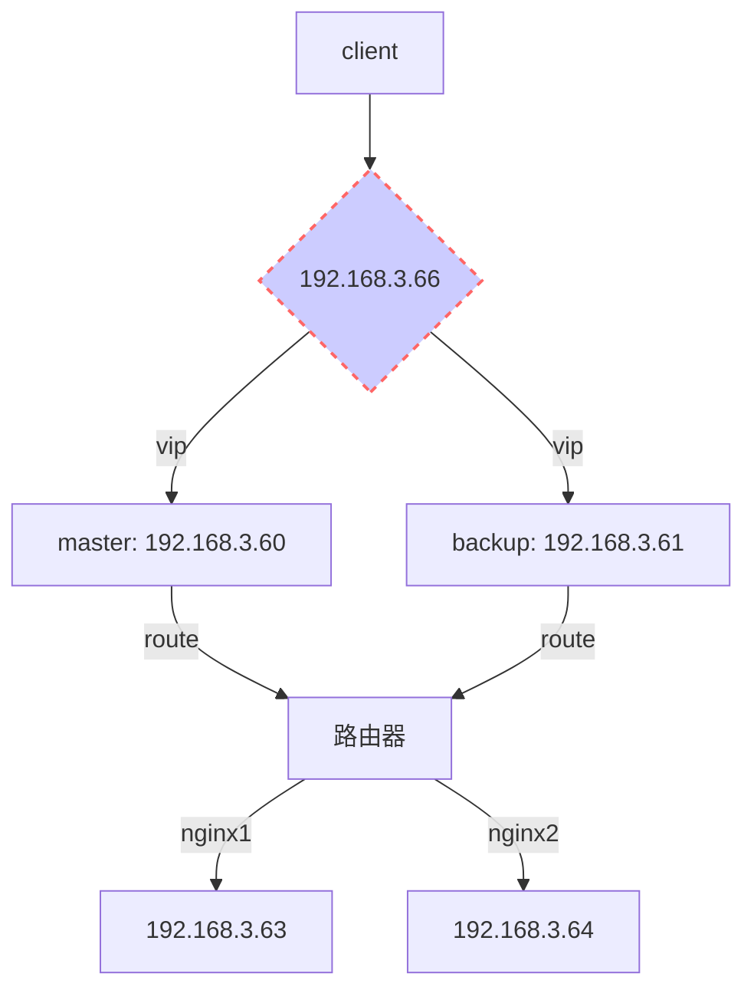

# nginx高可用集群

操作系统：centos7 

组件：lvs + keepalived


## 环境

**vip:** 192.168.3.66

**master**192.168.3.60

**backup:** 192.168.3.61

**nginx1:** 192.168.3.62

**nginx2:** 192.168.3.63

os: CentOS Linux release 7.3.1611 (Core)

kernal: Linux lvs2 3.10.0-327.el7.x86_64 #1 SMP Thu Nov 19 22:10:57 UTC 2015 x86_64 x86_64 x86_64 GNU/Linux




**负载均衡模式：DR（直接路由）**


## LVS节点

### 安装keepalive+lvs

```sh
$ mv /etc/yum.repos.d/CentOS-Base.repo /etc/yum.repos.d/CentOS-Base.repo.bak && curl -o /etc/yum.repos.d/CentOS-Base.repo http://mirrors.aliyun.com/repo/Centos-7.repo
$ yum install -y ipvsadm keepalived
```


### 配置(backup节点修改配置：router_id，state，priority)

```sh
$ mv /etc/keepalived/keepalived.conf /etc/keepalived/keepalived.conf.bak
$ cat <<EOF > /etc/keepalived/keepalived.conf
! Configuration File for keepalived

global_defs {
   notification_email {
   	 #故障接受联系人
     lan.xinen@inspireso.org
   }
   #故障发送人
   notification_email_from notify@inspireso.org
   smtp_server 127.0.0.1
   smtp_connect_timeout 30
   #BACKUP上修改为LVS_BACKUP
   router_id LVS_MASTER
}

vrrp_instance VI_1 {
	#BACKUP上修改为BACKUP
    state MASTER
    interface eno16777984
    #虚拟路由标识，主从相同
    virtual_router_id 51
    #BACKUP上修改为90
    priority 100
    advert_int 1
    #主从认证密码必须一致
    authentication {
        auth_type PASS
        auth_pass 1111
    }
    #虚拟IP（VTP）
    virtual_ipaddress {
        192.168.3.66
    }
}

#定义虚拟IP和端口
virtual_server 192.168.3.66 80 {
	#检查真实服务器时间，单位秒
    delay_loop 6
    #设置负载调度算法(rr|wrr|lc|wlc|lblc)
    ##rr: 轮训
    ##wrr: 加权轮叫
    ##lc: 最少链接
    ##wlc: 加权最少链接
    ##lblc: 基于局部性的最少链接
    lb_algo rr
    
    #设置LVS负载均衡DR模式(DR|NAT|tun)
    lb_kind DR
    #同一IP的连接60秒内被分配到同一台真实服务器
    persistence_timeout 0
    #使用TCP协议检查realserver状态
    protocol TCP

	#nginx1
    real_server 192.168.3.62 80 {
    	#节点权重值
        weight 1
        #健康检查方式
        HTTP_GET {
            url {
              path /
              status_code 200
            }
            #连接超时
            connect_timeout 3
            #重试次数
            nb_get_retry 3
            #重试间隔/S
            delay_before_retry 3
        }
    }

	#nginx2
    real_server 192.168.3.63 80 {
        weight 1
        HTTP_GET {
            url {
              path /
              status_code 200
            }
            connect_timeout 3
            nb_get_retry 3
            delay_before_retry 3
        }
    }
}

EOF

```


### 启动服务

```sh
$ systemctl enable keepalived && systemctl restart keepalived
```


## nginx节点

```sh
$ yum install net-tools

$ echo <<EOF > /etc/init.d/real.sh
#!/bin/bash

VIP=192.168.3.66

case "$1" in
  start)
      ifconfig lo:0 $VIP netmask 255.255.255.255 broadcast $VIP
      /sbin/route add -host $VIP dev lo:0
      echo "1" >/proc/sys/net/ipv4/conf/lo/arp_ignore
      echo "2" >/proc/sys/net/ipv4/conf/lo/arp_announce
      echo "1" >/proc/sys/net/ipv4/conf/all/arp_ignore
      echo "2" >/proc/sys/net/ipv4/conf/all/arp_announce
      sysctl -p >/dev/null 2>&1
      echo "RealServer Start OK"
      ;;
  stop)
      ifconfig lo:0 down
      route del $VIP >/dev/null 2>&1
      echo "0" >/proc/sys/net/ipv4/conf/lo/arp_ignore
      echo "0" >/proc/sys/net/ipv4/conf/lo/arp_announce
      echo "0" >/proc/sys/net/ipv4/conf/all/arp_ignore
      echo "0" >/proc/sys/net/ipv4/conf/all/arp_announce
      echo "RealServer Stoped"
      ;;
  *)
      echo "Usage: $0 {start|stop}"
      exit 1
esac

exit 0
EOF

$ chmod +x /etc/init.d/real.sh
$ /etc/init.d/real.sh start

# 配置开机自动启动
$ echo "/etc/init.d/real.sh start" >> /etc/rc.d/rc.local
$ chmod +x /etc/rc.d/rc.local
$ systemctl enable rc-local && systemctl start rc-local.service

```

